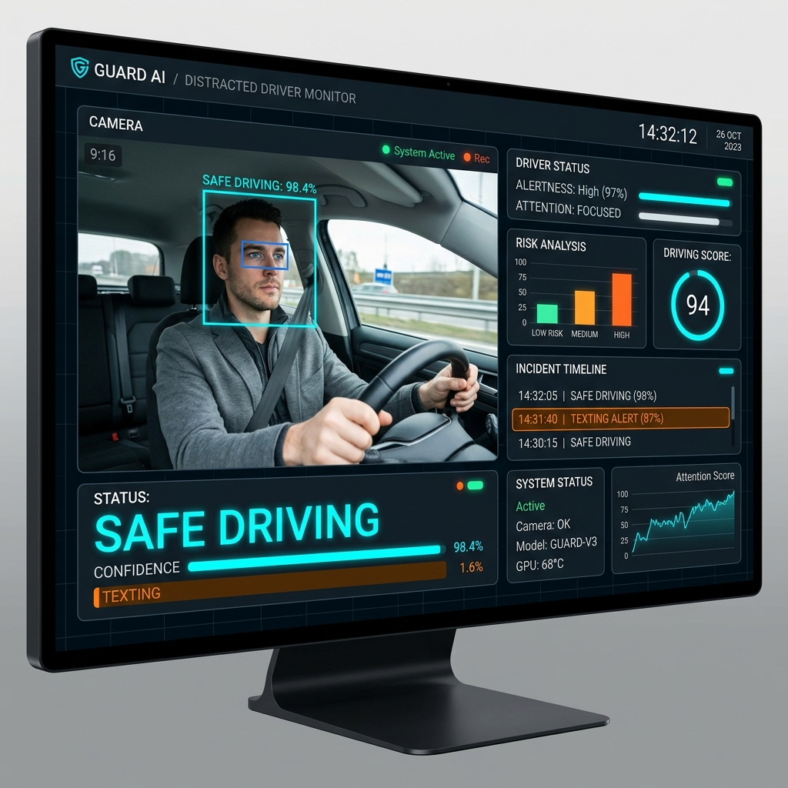

# SafeDriveVision

SafeDriveVision is a distracted driver detection system that classifies 10 distinct driver behaviors using a custom ResNet50 implementation built from scratch.

## Overview

Automated in-vehicle behavior classification from dashboard cameras is an active area of road safety AI research aimed at reducing road fatalities. This project categorizes driver behavior into 10 classes, addressing critical machine learning challenges such as high bias, high variance, and subject-level data leakage.

## Core Features

- **Custom ResNet50 Architecture**: Built entirely from scratch using the Keras functional API. Every bottleneck block and skip connection is manually defined rather than relying on pre-trained `tf.keras.applications`.
- **10-Class Classification**: Identifies behaviors like safe driving, texting, phone usage, operating the radio, drinking, and reaching behind.
- **Data Leakage Prevention**: Employs Leave-One-Group-Out (LOGO) cross-validation to ensure subject images remain strictly separated between training and validation sets.

## Driver Behavior Classes

The system categorizes driver actions into 10 distinct classes based on the State Farm Distracted Driver Detection dataset:

- **c0**: Safe driving
- **c1**: Texting (Right hand)
- **c2**: Talking on the phone (Right hand)
- **c3**: Texting (Left hand)
- **c4**: Talking on the phone (Left hand)
- **c5**: Operating the radio
- **c6**: Drinking
- **c7**: Reaching behind
- **c8**: Hair and makeup
- **c9**: Talking to a passenger

## Technical Stack

- Language: Python 3.7+
- Framework: TensorFlow / Keras
- Architecture: ResNet50 (Custom Implementation)
- Data Manipulation: Pandas, NumPy

## Dataset and Preprocessing

The model is trained on a dataset of dashboard camera images. To prepare the data for the ResNet50 architecture, the following preprocessing steps are applied:

1. **Resizing**: All high-resolution images are resized to a standardized input shape of 64x64 pixels with 3 RGB channels (64, 64, 3) to optimize training time and memory consumption.
2. **Normalization**: Pixel values are normalized by dividing by 255.0 to bring them into the [0, 1] range, stabilizing the gradient descent process.
3. **One-Hot Encoding**: The categorical string labels (c0-c9) are mapped to integer values (0-9) and formatted for the Sparse Categorical Cross-Entropy loss function.

## Detailed Model Architecture: ResNet50 From Scratch

While pre-trained models are industry standard for rapid deployment, implementing ResNet50 from scratch serves as a deep technical validation of understanding architectural concepts. By manually defining the `identity_block` and `convolutional_block`, the project demonstrates granular control over tensor shapes, shortcut paths, and the exact dimensional changes across 5 deep network stages.

### Network Stages

1. **Stage 1**: Initial Convolution. 7x7 filters with a stride of 2, followed by Batch Normalization, ReLU activation, and 3x3 Max Pooling.
2. **Stage 2**: 1 Convolutional Block + 2 Identity Blocks. Filter configuration: [64, 64, 256].
3. **Stage 3**: 1 Convolutional Block + 3 Identity Blocks. Filter configuration: [128, 128, 512].
4. **Stage 4**: 1 Convolutional Block + 5 Identity Blocks. Filter configuration: [256, 256, 1024].
5. **Stage 5**: 1 Convolutional Block + 2 Identity Blocks. Filter configuration: [512, 512, 2048].
6. **Output Layer**: Average Pooling followed by a Flatten layer and a Fully Connected (Dense) layer with 10 units and Softmax activation.

## Challenges Faced & Solutions Implemented

### 1. Data Leakage and Validation Integrity
**The Challenge**: The State Farm dataset contains multiple frames of the same drivers. Standard random train/test splits caused the model to train and validate on different images of the *same* person. This inflated validation accuracy, as the model learned to recognize the driver's clothing and appearance rather than the distracted behavior itself.

**The Solution**: Implemented a **Leave-One-Group-Out (LOGO)** cross-validation strategy. By grouping the dataset by `subject` (driver ID) from the metadata CSV, the split ensures that the validation set only evaluates drivers the network has never seen before.

### 2. High Bias (Underfitting) During Initial Stages
**The Challenge**: Early training epochs (e.g., Epoch 2) demonstrated high bias, with training accuracy hovering around 26%. The model was struggling to capture the complex visual patterns of driver behavior from the 64x64 pixel images.

**The Solution**: 
- Increased the epoch count to allow the network more time to converge.
- Maintained the deep, 50-layer architecture of ResNet to ensure the model had sufficient capacity to learn complex hierarchical features.
- Used the Adam optimizer to adapt learning rates dynamically across parameters.

### 3. High Variance (Overfitting) as Training Progressed
**The Challenge**: By Epoch 5, while training accuracy improved to roughly 37.8%, the validation accuracy plateaued at 25.7%. The variance gap dramatically increased by over 80%, indicating the model had started memorizing training data rather than generalizing.

**The Solution**:
- **Data Augmentation**: (Future/Planned) Introducing random rotations, zoom, and shifts to artificially expand the dataset diversity.
- **Regularization**: Applying techniques like L2 regularization and Dropout layers to penalize over-reliance on specific nodes, forcing the network to distribute learned representations evenly.

## Project Structure

- src/config.py: Configuration and hyperparameter definitions.
- src/data.py: Data loading, preprocessing, and Kaggle dataset handling.
- src/model.py: Custom ResNet50 architecture components.
- src/train.py: Model training loop and cross-validation strategy.
- src/evaluate.py: Inference and test performance evaluation.
- main.py: CLI entry point for execution.

## Getting Started

1. Set up the environment:
   python -m venv venv
   source venv/bin/activate
   pip install -r requirements.txt

2. Run the application:
   python main.py --help

